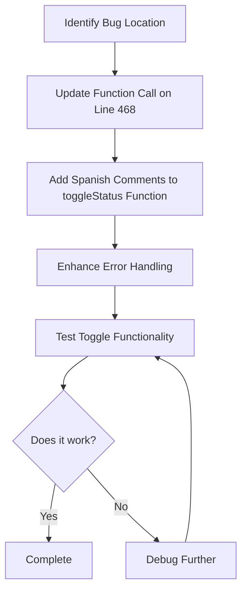

# Plan: Fix Toggle Status Bug in Admin Dashboard

## Problem Description

When attempting to hide or show a product in the catalog from the inventory panel, an error appears in the browser: **"localhost:3000 dice Error al actualizar el estado."** The product status does not update.

## Root Cause Analysis

### Issue Location
- **File**: [`pages/AdminDashboard.tsx`](pages/AdminDashboard.tsx:468)
- **Line**: 468

### The Bug
The `toggleStatus` function is being called with only the tire ID (a string):
```tsx
<button onClick={() => toggleStatus(tire.id)} ...>
```

However, the function definition expects a complete `Tire` object:
```tsx
const toggleStatus = async (tire: Tire) => {
  try {
    const newStatus = tire.status === 'inactive' ? 'active' : 'inactive';
    await updateTireData(tire.id, { status: newStatus as any });
  } catch (err) {
    alert("Error al actualizar el estado.");
  }
};
```

### Why It Fails
When `tire.id` (a string) is passed instead of the full `tire` object:
- `tire.status` tries to access a property on a string → `undefined`
- `tire.id` tries to access a property on a string → `undefined`
- The `updateTireData` function receives invalid parameters
- The operation fails and triggers the error alert

## Solution Design

### Fix Strategy
Change the function call on line 468 to pass the entire `tire` object instead of just `tire.id`.

### Code Changes Required

#### Change in AdminDashboard.tsx (Line 468)

**Before:**
```tsx
<button onClick={() => toggleStatus(tire.id)} className={...}>
```

**After:**
```tsx
<button onClick={() => toggleStatus(tire)} className={...}>
```

### Additional Improvements

1. **Enhanced Error Handling**: Update the error message to be more descriptive
2. **Add Comments**: Include Spanish comments explaining the fix
3. **Console Logging**: Add optional console logging for debugging

### Updated toggleStatus Function (Lines 120-127)

```tsx
// INICIO DE MODIFICACIÓN: Función para alternar visibilidad del producto en el catálogo
const toggleStatus = async (tire: Tire) => {
  try {
    // Determinar el nuevo estado: si está inactivo, activarlo; si está activo, desactivarlo
    const newStatus = tire.status === 'inactive' ? 'active' : 'inactive';
    
    // Actualizar el estado en la base de datos (Firebase o LocalStorage)
    await updateTireData(tire.id, { status: newStatus as any });
    
    // Opcional: Log para debugging
    console.log(`Estado del producto ${tire.model} actualizado a: ${newStatus}`);
  } catch (err) {
    console.error("Error al actualizar el estado del producto:", err);
    alert("Error al actualizar el estado. Por favor, intenta nuevamente.");
  }
};
// FIN DE MODIFICACIÓN
```

## Implementation Steps



## Testing Plan

### Test Cases

1. **Test Active → Inactive**
   - Click "Ocultar" button on an active product
   - Verify product becomes semi-transparent (opacity-30)
   - Verify button text changes to "Mostrar"
   - Verify no error alert appears

2. **Test Inactive → Active**
   - Click "Mostrar" button on an inactive product
   - Verify product returns to full opacity
   - Verify button text changes to "Ocultar"
   - Verify no error alert appears

3. **Test Persistence**
   - Toggle a product status
   - Refresh the page
   - Verify the status persists correctly

4. **Test Multiple Products**
   - Toggle status on multiple products
   - Verify each operates independently

## Files to Modify

- [`pages/AdminDashboard.tsx`](pages/AdminDashboard.tsx)
  - Line 468: Fix function call
  - Lines 120-127: Add comments and improve error handling

## Expected Outcome

After implementing this fix:
- ✅ The toggle button will work correctly
- ✅ Products will switch between "active" and "inactive" states
- ✅ No error alerts will appear
- ✅ Visual feedback (opacity change) will work properly
- ✅ Button text will update correctly ("Mostrar" ↔ "Ocultar")
- ✅ Code will have clear Spanish comments explaining the functionality

## Notes

- The fix is minimal and surgical - only one line needs to change
- The existing logic in `toggleStatus` is correct
- The `updateTireData` function in [`services/firebase.ts`](services/firebase.ts:86) works correctly with both Firebase and LocalStorage
- No changes needed to the Firebase service layer
