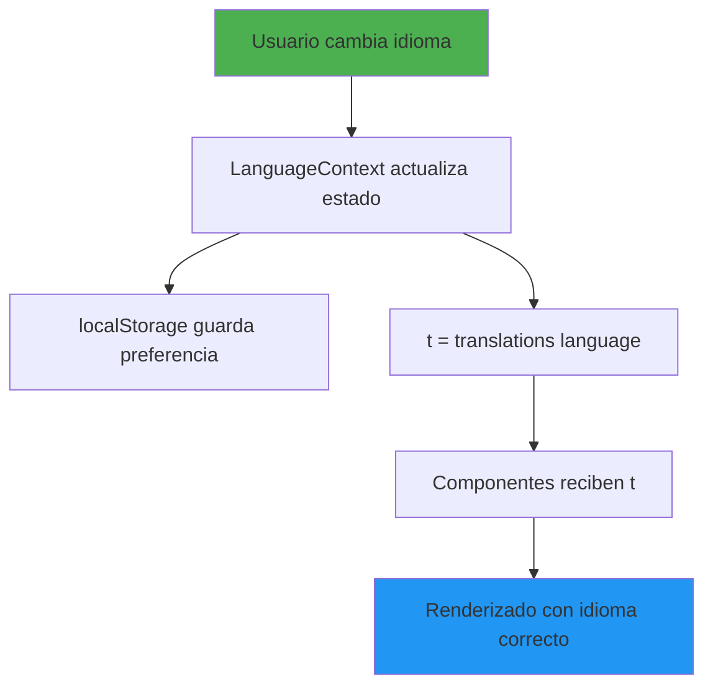
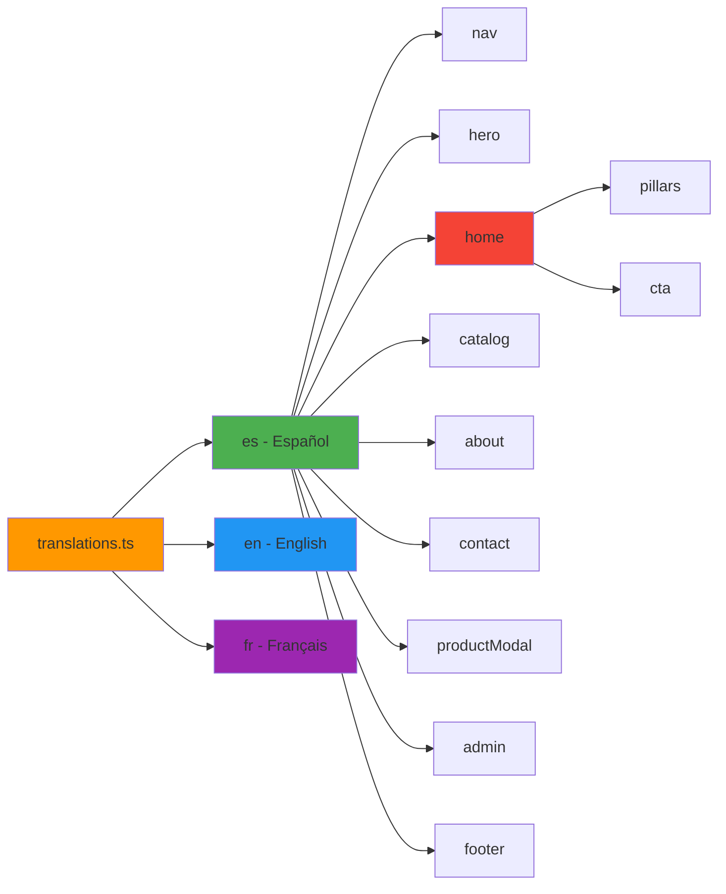

# Plan de Corrección de Traducciones / Translation Fixes Plan

## Análisis del Problema / Problem Analysis

### Estado Actual / Current State

El sitio tiene un sistema de traducciones implementado con tres idiomas:
- **Español (es)** - Idioma por defecto
- **Inglés (en)**
- **Francés (fr)**

### Problemas Identificados / Issues Identified

#### 1. **Textos Hardcodeados en Home.tsx**
Los siguientes textos están escritos directamente en español en lugar de usar las claves de traducción:

**Hero Section:**
- ❌ "Más que neumáticos, potencia y seguridad para tu operación"
- ❌ "Excelencia en cada rodado. Estética premium para entusiastas del automovilismo y vehículos de alta gama."
- ❌ "Ver Catálogo"
- ❌ "Contactar Vendedor"

**Pillars Section:**
- ❌ "Nuestros Pilares"
- ❌ "Calidad superior y atención especializada para tu vehículo."
- ❌ "Ventas al Mayor"
- ❌ "También hacemos ventas al por mayor en contenedores."
- ❌ "Soporte Especializado"
- ❌ "Asesoramiento técnico personalizado brindado por el vendedor."
- ❌ "Catálogo Extenso"
- ❌ "Variedad total de medidas y marcas disponibles para su camión o trailer."

**CTA Section:**
- ❌ "Atención Directa"
- ❌ "¿Buscas asesoramiento para tu compra?"
- ❌ "Habla directamente con nuestro vendedor especializado para obtener recomendaciones personalizadas y resolver todas tus dudas."
- ❌ "Contactar Vendedor"

#### 2. **Traducciones Faltantes en translations.ts**

**En la sección `nav`:**
- ✅ Español: Falta la clave `admin`
- ✅ Inglés: Tiene `admin: 'Admin'`
- ✅ Francés: Tiene `admin: 'Admin'`

**Necesitamos agregar nuevas secciones:**
- `home.pillars` - Para la sección "Nuestros Pilares"
- `home.cta` - Para la sección de llamada a acción

## Solución Propuesta / Proposed Solution

### Paso 1: Actualizar translations.ts

Agregar las siguientes claves de traducción:

```typescript
// Español (es)
nav: {
  home: 'Inicio',
  catalog: 'Catálogo',
  about: 'Nosotros',
  contact: 'Contacto',
  admin: 'Admin' // ← AGREGAR
},
home: {
  pillars: {
    title: 'Nuestros Pilares',
    subtitle: 'Calidad superior y atención especializada para tu vehículo.',
    wholesale: {
      title: 'Ventas al Mayor',
      desc: 'También hacemos ventas al por mayor en contenedores.'
    },
    support: {
      title: 'Soporte Especializado',
      desc: 'Asesoramiento técnico personalizado brindado por el vendedor.'
    },
    catalog: {
      title: 'Catálogo Extenso',
      desc: 'Variedad total de medidas y marcas disponibles para su camión o trailer.'
    }
  },
  cta: {
    badge: 'Atención Directa',
    title: '¿Buscas asesoramiento para tu compra?',
    description: 'Habla directamente con nuestro vendedor especializado para obtener recomendaciones personalizadas y resolver todas tus dudas.',
    button: 'Contactar Vendedor'
  }
}

// Inglés (en)
home: {
  pillars: {
    title: 'Our Pillars',
    subtitle: 'Superior quality and specialized attention for your vehicle.',
    wholesale: {
      title: 'Wholesale Sales',
      desc: 'We also do wholesale sales in containers.'
    },
    support: {
      title: 'Specialized Support',
      desc: 'Personalized technical advice provided by the seller.'
    },
    catalog: {
      title: 'Extensive Catalog',
      desc: 'Full variety of sizes and brands available for your truck or trailer.'
    }
  },
  cta: {
    badge: 'Direct Attention',
    title: 'Looking for advice on your purchase?',
    description: 'Speak directly with our specialized seller to get personalized recommendations and resolve all your questions.',
    button: 'Contact Seller'
  }
}

// Francés (fr)
home: {
  pillars: {
    title: 'Nos Piliers',
    subtitle: 'Qualité supérieure et attention spécialisée pour votre véhicule.',
    wholesale: {
      title: 'Ventes en Gros',
      desc: 'Nous faisons également des ventes en gros en conteneurs.'
    },
    support: {
      title: 'Support Spécialisé',
      desc: 'Conseils techniques personnalisés fournis par le vendeur.'
    },
    catalog: {
      title: 'Catalogue Étendu',
      desc: 'Variété complète de tailles et de marques disponibles pour votre camion ou remorque.'
    }
  },
  cta: {
    badge: 'Attention Directe',
    title: 'Vous cherchez des conseils pour votre achat ?',
    description: 'Parlez directement avec notre vendeur spécialisé pour obtenir des recommandations personnalisées et résoudre toutes vos questions.',
    button: 'Contacter le Vendeur'
  }
}
```

### Paso 2: Actualizar Home.tsx

Reemplazar todos los textos hardcodeados con las claves de traducción:

**Antes:**
```tsx
<h1>Más que neumáticos, <br/> ...</h1>
```

**Después:**
```tsx
<h1>{t.hero.title}</h1>
```

### Paso 3: Verificación de Componentes

Revisar que todos los componentes usen correctamente las traducciones:
- ✅ [`Navbar.tsx`](components/Navbar.tsx) - Ya usa `t.nav.*`
- ✅ [`Footer.tsx`](components/Footer.tsx) - Ya usa `t.footer.*`
- ✅ [`ProductModal.tsx`](components/ProductModal.tsx) - Ya usa `t.productModal.*`
- ✅ [`About.tsx`](pages/About.tsx) - Ya usa `t.about.*`
- ✅ [`Contact.tsx`](pages/Contact.tsx) - Ya usa `t.contact.*`
- ✅ [`Catalog.tsx`](pages/Catalog.tsx) - Ya usa `t.catalog.*`
- ❌ [`Home.tsx`](pages/Home.tsx) - **NECESITA CORRECCIÓN**
- ✅ [`AdminDashboard.tsx`](pages/AdminDashboard.tsx) - Ya usa `t.admin.*`

## Estructura de Archivos Afectados / Affected Files

```
d:/PROYECTOS/neumaticosjp/
├── translations.ts          ← Agregar nuevas claves
├── pages/
│   └── Home.tsx            ← Reemplazar textos hardcodeados
└── plans/
    └── translation-fixes-plan.md  ← Este documento
```

## Diagrama de Flujo de Traducciones / Translation Flow Diagram



## Diagrama de Estructura de Traducciones / Translation Structure Diagram



## Beneficios de la Corrección / Benefits

1. **Consistencia Multiidioma**: Todos los textos estarán disponibles en los 3 idiomas
2. **Mantenibilidad**: Cambios de texto centralizados en un solo archivo
3. **Escalabilidad**: Fácil agregar nuevos idiomas en el futuro
4. **Experiencia de Usuario**: Los usuarios verán el sitio completamente en su idioma preferido
5. **Profesionalismo**: Demuestra atención al detalle y calidad del producto

## Próximos Pasos / Next Steps

1. ✅ Crear este plan de acción
2. ⏳ Obtener aprobación del usuario
3. ⏳ Implementar cambios en [`translations.ts`](translations.ts)
4. ⏳ Actualizar [`Home.tsx`](pages/Home.tsx)
5. ⏳ Probar cambio de idiomas en el navegador
6. ⏳ Verificar que no haya errores de consola
7. ⏳ Documentar el sistema para futuros desarrolladores

## Notas Técnicas / Technical Notes

- El sistema usa React Context API para gestionar el estado del idioma
- Las preferencias se guardan en `localStorage`
- El idioma por defecto es español (`es`)
- Los componentes acceden a las traducciones mediante el hook `useLanguage()`
- La estructura de traducciones es type-safe con TypeScript

---

**Fecha de Creación**: 2026-02-07  
**Autor**: Kilo Code (Architect Mode)  
**Estado**: Pendiente de Aprobación
